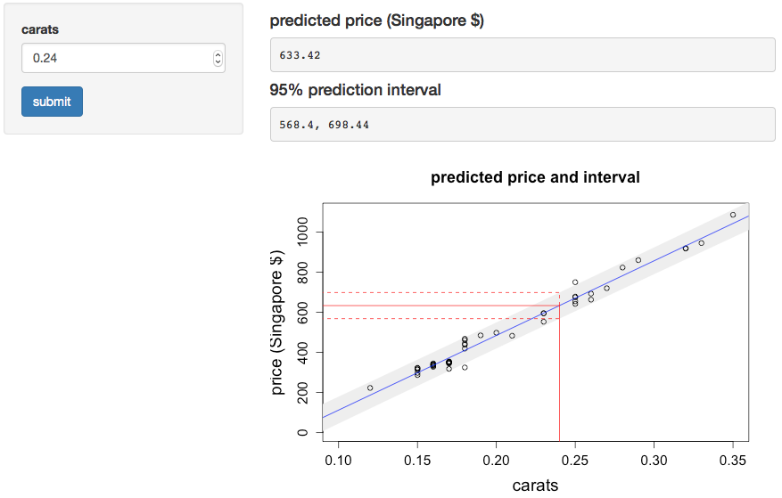

## Goal

A Shiny web app that 

* Allow the user to interactively enter the weight of a diamond in carats;
* Show the predicted price of the diamond;
* Show a 95% prediction interval for the price of the diamond;
* Plot the regression line, showing the predicted price and prediction interval.

This app will be valuable for teaching data science:

* It will show linear regression and prediction intervals;
* It will demonstrate how to build a Shiny app.

---

## The app

The model used in the app is a simple linear regression (the <code>lm</code> function in R). This built on the familiar <code>diamond</code> dataset (in the <code>UsingR</code> library). This gives prices (in Singapore dollars) of diamonds by carat; the data include 48 observations.

```{r}
library(UsingR)
data(diamond)
str(diamond)
x <- diamond$carat; y <- diamond$price
fit <- lm(y ~ x)
```

---
We can build a plot in R to show the linear regression and prediction intervals.

Here we show the prediction interval for a 0.24 carat diamond. 

This is implemented in the app itself (UI screenshot next slide). This realizes our goal.

```{r echo=FALSE, eval=TRUE, fig.height=6, fig.width=8}
input.carats <- 0.24; xseq <- seq(0.05,0.375,0.01)
pred.bands <- predict(fit, newdata = data.frame(x = xseq), 
                           interval="prediction")
pred.ci <- predict(fit, newdata = data.frame(x = input.carats), 
                           interval="prediction")
plot(x, y, xlab="carats", ylab="price (Singapore $)", type="n", 
     main="predicted price and interval", cex.main=1.5,
     xlim=c(0.1,0.35),ylim=c(0,1100), cex.lab=1.6, cex.axis=1.3, cex=1.3) 
# add prediction band
perimeter_x <- c(xseq, rev(xseq))
perimeter_y <- c(pred.bands[,2], rev(pred.bands[,3]))
polygon(perimeter_x, perimeter_y, col="#EEEEEE", border=NA)
# add diamond plot points and regression line
points(x, y) 
abline(fit,col="blue")
# add red linels showing predicted value and CI on plot
lines(c(input.carats,input.carats), c(-100, pred.ci[1]), lty=1, lwd=1, col="red")
lines(c(input.carats,input.carats), c(pred.ci[1], pred.ci[3]), lty=2, col="red")
lines(c(0,input.carats), c(pred.ci[3], pred.ci[3]), 
      col="red", lwd=1, lty=2)
lines(c(0,input.carats), c(pred.ci[2], pred.ci[2]), 
      col="red", lwd=1, lty=2)
lines(c(0,input.carats), c(pred.ci[1], pred.ci[1]), 
      col="red", lwd=1, lty=1)

```

---





