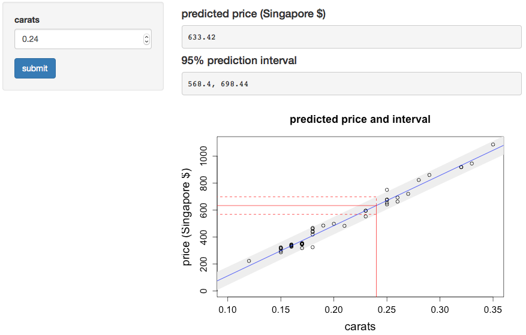

## Goal

A Shiny web app that 

* Allow the user to interactively enter the weight of a diamond in carats;
* Show the predicted price of the diamond;
* Show a 95% prediction interval for the price of the diamond;
* Plot the regression line, showing the predicted price and prediction interval.

This app will be valuable for teaching data science:

* It will show linear regression and prediction intervals;
* It will demonstrate how to build a Shiny app.

---

## The app

The model used in the app is a simple linear regression (the <code>lm</code> function in R). This built on the familiar <code>diamond</code> dataset (in the <code>UsingR</code> library). This gives prices (in Singapore dollars) of diamonds by carat; the data include 48 observations.


```r
library(UsingR)
data(diamond)
str(diamond)
```

```
## 'data.frame':	48 obs. of  2 variables:
##  $ carat: num  0.17 0.16 0.17 0.18 0.25 0.16 0.15 0.19 0.21 0.15 ...
##  $ price: int  355 328 350 325 642 342 322 485 483 323 ...
```

```r
x <- diamond$carat; y <- diamond$price
fit <- lm(y ~ x)
```

---
We can build a plot in R to show the linear regression and prediction intervals.

Here we show the prediction interval for a 0.24 carat diamond. 

This is implemented in the app itself (UI screenshot next slide). This realizes our goal.


---





